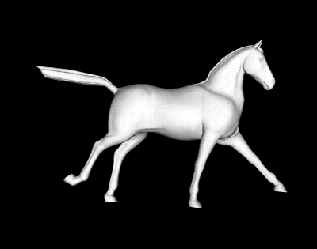

This is a clean, minimal Python implementation of the paper

        Ladislav Kavan, Peter-Pike Sloan, Carol O'Sullivan.
        "Fast and Efficient Skinning of Animated Meshes."
        Computer Graphics Forum 29(2) [Proceedings of Eurographics], 2010

The code is in no way associated with any of the authors of the paper. I did the reimplementation for a state-of-the-art comparison for my paper "Sparse Localized Deformation Components" (SIGGRAPH Asia 2013). I thought I'd clean up the code an finally put it online ;-)

# A motivating example

The method implemented here takes an arbitrary mesh animation such as this galloping horse from [Robert Sumner's Page](https://people.csail.mit.edu/sumner/research/deftransfer/data.html):

 

The algorithm then estimates linear blend skinning weights as well as bone transformations in order to reproduce the input mesh animation as closely as possible. The result looks like this:


In the above movie, each automatically found "body part" is colored differently (more precisely, it shows the linear blend skinning weights optimized by the method). The bone transformations are also visualized as coordinate axes. 

Essentially, the code here performs a task that is commonly called "skinning decomposition" in computer graphics. Skinning decomposition can be useful for quick and memory-efficient display of a given mesh animation on GPU's or in game engines, but it may also be used for more complex tasks such as rigid stabilization, sometimes also called pose normalization. Skinning decomposition can also be seen as a form of compression: each frame of the animation can be recreated only from the 3x4 transformation matrices of the (here, 18) body parts. 

To reproduce the results shown above using Anaconda, do the following on the command line:
```
$ git clone http://github.com/tneumann/skinning_decomposition_kavan
$ cd skinning_decomposition_kavan
$ conda env create -f environment.yml
$ source activate skinning_decomposition_kavan
```
Now we can download and unzip the sample data:
```
$ wget https://people.csail.mit.edu/sumner/research/deftransfer/data/horse-gallop.tgz
$ tar xvzf horse-gallop.tgz
$ rm horse-gallop/horse-gallop-reference.obj
```
And then convert the data, run the decomposition, and visualize the results using:
```
$ python convert_obj_sequence.py horse-gallop horse-gallop.h5 
$ python decompose_kavan.py horse-gallop.h5 horse-gallop-bones.h5 18 -f
$ python view_animation.py horse-gallop-bones.h5
```

# Scripts

## decompose_kavan.py

Implements the main algorithm. Some documentation of the command line parameters is available:
```
$ python kavan.py --help
```

## convert_sma_data.py

Can convert the data from the 
[project page of the paper of Kavan et al.](https://www.cs.utah.edu/~ladislav/kavan10fast/kavan10fast.html)
into hdf5 format to be viewed with view_animation.py.
This is mostly to check if our reimplementation yields the same results as Ladislav's method.
Example:
```
$ python convert_sma_data.py <path-to-data-from-website>/horse.skin.txt horse_sma.h5
$ python view_animation.py horse_sma.h5
```

## view_animation.py

Can view reconstructed animations as well as their estimated bone positions.
